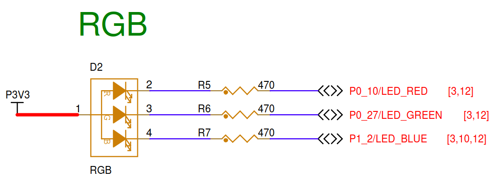
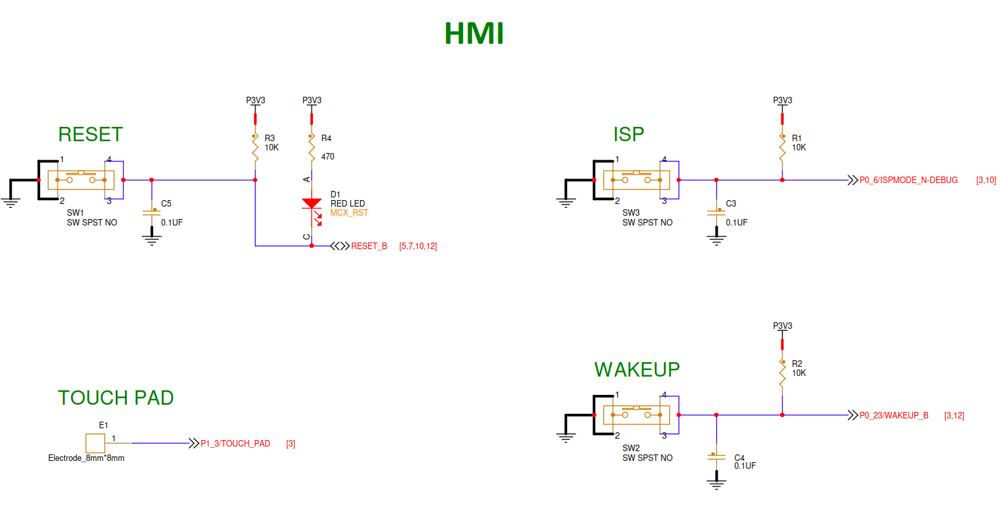
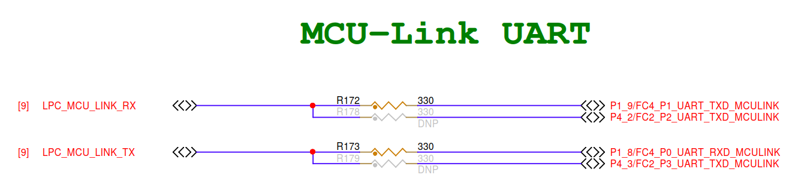

# Zephyr命令

## 代理设置方法
```
$env:http_proxy="http://127.0.0.1:10808"
$env:https_proxy="http://127.0.0.1:10808"
```
## 工程文件查找技巧

### 命令输出筛选功能
```
west boards | Select-String -Pattern "FRDM-MCXN947"
```

### 查找当前目录及其所有子目录中，文件名包含 'ap3216c' 的所有文件
```
Get-ChildItem -Recurse -Filter '*ap3216c*' -ErrorAction SilentlyContinue
```

### 查找 dts/bindings/sensor 目录下所有 *.yaml 文件内容中包含 'ap3216c' 的文件
```
Get-ChildItem -Path .\dts\bindings\sensor -Recurse -Include *.yaml | Select-String -Pattern "ap3216c" -AllMatches
```
- 命令详解：Get-ChildItem -Path .\dts\bindings\sensor -Recurse -Include *.yaml:
    - 首先，找到 dts\bindings\sensor 目录下所有的 YAML 文件。
    - '|': 将上一个命令的输出（文件对象）作为输入，传递给下一个命令。
    - Select-String -Pattern "ap3216c" -AllMatches:
        - 在传入的文件对象的内容中搜索 "ap3216c" 字符串。
        - 输出结果会显示文件名和匹配的行号。

### 查搜索子目录内的所有文件内容，查找含有'DMA'文件
```
Get-ChildItem -Path . -Recurse -Filter *.* | Select-String -Pattern "p3t1755"
Get-ChildItem -Path . -Recurse -Include *.overlay,*.dts | Select-String -Pattern "p3t1755"
```
- 命令解释：
    - Get-ChildItem -Path . -Recurse: 递归地获取当前目录 (.) 及其所有子目录下的所有文件和文件夹。
    - -Filter *.*: 确保只处理文件（如果只搜索特定类型文件，例如 .c 和 .dts，可以改为 -Include *.c,*.dts,*.conf）。
    - |: 管道操作符，将前一个命令的输出传递给后一个命令。
    - Select-String -Pattern "DMA": 在接收到的所有文件的内容中搜索包含字符串 "DMA" 的行。

## west常用命令

### 编译指定开发板

```
west build -p always -b frdm_mcxn947/mcxn947/cpu0 samples\basic\blinky
west build -p auto -b frdm_mcxn947/mcxn947/cpu0 .\app
west build -p always -b frdm_mcxn947/mcxn947/cpu0 .\app
west build -b frdm_mcxn947/mcxn947/cpu0 -t menuconfig .\app
west build -b frdm_mcxn947/mcxn947/cpu0 -t guiconfig .\app
west build -t clean
```

### 清理构建（Build）目录

```
west build -t clean
west build -t traceconfig
```

## overlay设置

### PWM功能
```
#include <dt-bindings/pinctrl/stm32-pinctrl.h>
#include <dt-bindings/pwm/pwm.h>
```

## Zephyr Shell 提供的内置命令

### 开启线程统计功能 (Kconfig)

- 在 prj.conf 中，你需要确保开启了以下宏，否则 Shell 里看不到线程相关的详细统计：
```
# 开启内核对象查询（必须）
CONFIG_THREAD_MONITOR=y
# 开启线程名显示（方便识别是哪个任务）
CONFIG_THREAD_NAME=y
# 开启栈分析功能（查看具体使用了百分之几）
CONFIG_THREAD_STACK_INFO=y
CONFIG_THREAD_ANALYZER=y
```

- 使用 Shell 命令查看
```
kernel threads
kernel thread analyzer
```

## 引脚配置

### RGB LED



RGB引脚配置
* LED_R P0_10   低电平有效
* LED_G P0_27   低电平有效
* LED_B P1_2    低电平有效

### 按键



按键引脚配置
* SW1   RESET_B         低电平有效,连接多个IC复位引脚
* SW2   WAKEUP  P0_23   低电平有效,连接多个IC复位引脚
* SW3   ISP     P0_6    低电平有效
* Touch_Pad     P1_3    模拟输入

### UART



UART引脚配置
* UART_TXD  P1_9/FC4_P1_UART_TXD
* UART_RXD  P1_8/FC4_P0_UART_RXD